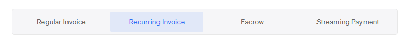

# FAQ

## **Issuing invoices**

## How to create an invoice using Request Finance?

Follow the [creating an invoice](getting-started-guide.md#creating-a-digital-currency-invoice-in-a-few-simple-steps) section of our Getting Started Guide, where we dive into the process step-by-step.

### **What information should I include on my invoice?**

When issuing an invoice, you need to be aware of all local and national requirements for your invoice to be compliant. This varies, but a general rule of thumb is to include your name, business name, legal address and tax number.\
\
**For more specific guidance see the following resources:**

[**European Union**](https://ec.europa.eu/taxation\_customs/business/vat/eu-vat-rules-topic/vat-invoicing-rules\_en)\
\*\*\*\*[United State of America](https://www.ionos.com/startupguide/grow-your-business/requirements-for-a-proper-invoice/)

### **How do I receive digital currencies (cryptocurrencies) for my business?**

In order to receive cryptocurrency, you need a wallet address. These wallet addresses are unique addresses (consisting of letters and numbers) that allow you to manage your funds.\
\
You control your wallet through an application, just like the online banking app you use now.\
\
To accept ETH, DAI, USDT and other \*\*\*\* Ethereum-based \*\*\*\* ERC20 tokens, you will need an Ethereum address. For beginners you can receive all these currencies on a [Coinbase account.](https://www.coinbase.com/signup)\\

Once more familiar with handling cryptocurrencies, we recommend moving your funds off exchanges and keep them on a wallet that you own the private keys to. \*\*\*\* [Here](https://ethereum.org/en/wallets/find-wallet/) is a helpful guide on how to do this.

To get paid on Polygon, Fantom, Fuse, Celo or other blockchains, you need to know how they work. [Metamask ](https://metamask.io)supports all EVM blockchains and lets you access all Request Finance features.

### How to enable my customers to pay with cryptocurrencies using Request Finance?

By creating an invoice with Request Finance your customers will receive an automatic email with a link to the invoice. All they have to do is click on accept and pay from within the invoice.

### **Can I get paid by credit card?**

Yes, you need to [setup a Stripe account](https://dashboard.stripe.com/register) first. You can setup your Stripe account right from the [Invoice creation page](https://app.request.finance/create), by picking a fiat currency as the invoice currency and then "in EUR, the payer pays in EUR" for example.

### **Can my clients pay in fiat (USD, EUR etc.) by bank transfer?**

Yes, you can denominate an invoice in fiat and then pick **How do you want to receive the funds? In fiat, the payer pays in fiat**. Your client can later notify you about the payment, and you have to do the reconciliation manually.

For EUR businesses: we partnered with Monerium to offer a smooth fiat-to-crypto payment experience. You client pays with a usual bank transfer in Euro, and you receive DeFi-ready EURe tokens. [More information here.](https://www.request.finance/fiat-to-crypto-payments)

### **Can I get paid in BTC?**

Yes, but Request Finance does not detect BTC payments. The payer will notify you when he makes the payment.

To accept BTC, you will need a Bitcoin wallet address. We recommend using [Coinbase](https://www.coinbase.com/signup).

### **What currencies can I issue an invoice in?**

All currencies which are currently supported by Request Finance [can be found here.](currencies-supported.md#the-supported-invoice-and-payment-currencies-of-request-invoicing)

### Why would I accept cryptocurrencies payments?

We're seeing an increase in clients that prefer to pay in cryptocurrency over traditional currencies. This is because the high-speed payments get processed on cryptocurrency payment networks, as well as the relatively small fees associated with larger value transfers.

Especially when dealing with international transactions, accepting cryptocurrencies can have a big positive effect on your companies' bottom line.

### What are the bookkeeping implications of getting paid in cryptocurrencies?

The same bookkeeping implications apply to regular invoices charged in traditional currencies like USD or EUR. Capital gains (if any) must be added as revenues. and receive in fiat.

For an invoice denominated in fiat currency for which you receive cryptocurrency payments, the accountant acts similar as with an international payment - taking into account exchange rate gains and losses.

In addition, there may be some capital gains or losses associated with receiving digital assets. This is mitigated by using stable tokens such as DAI or USDT for your business

### I have an accountant who does my company bookkeeping, how do I manage?

For invoices denominated in a fiat currency which payment is received in the same currency at the end of the process, the bookkeeping of the transaction is the same as usual.

The accountant does not need to be informed about using blockchain technology, as the amount received in the bank account matches the amount of the invoice.

Invoices paid in cryptocurrencies are different. Go to your [Request Finance](https://app.request.finance) dashboard, export your invoices as a CSV or download them individually as PDFs and send them to your accountant. Your accountant will then have all of the information needed to finalize your accounting.

Your accountant will manage these invoices in a similar way as a payment in a foreign currency, including exchange rate gains and losses, and additionally might also have to book capital gains.


Is your accountant unsure about how to proceed? [Get in touch](https://calendly.com/christophel-1) and we will connect with him/her directly to help them out!


### How do I upload my logo on the invoice?

Customizing your invoice by adding your company logo is a feature we're currently working on and is currently unavailable.

### How do I set up recurring invoices?

Before you send the first occurrence of a recurring invoice, click on "I want this to be a recurring invoice", at the bottom. The app guides to configuring the recurrence settings.

## **Making payments**

### **How do I pay an invoice in cryptocurrency?**

In order to pay an invoice, you need to use a wallet that has Web3 capability with enough funds to cover the payment amount requested. You also need to have enough funds to pay for the gas (ex: some ETH on Ethereum).

Web3 is the new generation of technology that empowers the individual over the institution through decentralization. \*\*\*\* When managing your finances, you can think of your Web3 wallet as your online banking app -- but without the bank.\
\
Not sure which wallet to use? [Here](https://ethereum.org/en/wallets/find-wallet/) is a helpful guide.

### How do I pay with a mobile device?

Request Finance is compatible with any wallet that supports WalletConnect.

### How do I pay while on the road?

Please use Chrome mobile app to log in to Request Finance. Once you are ready to pay an invoice, click on the "Pay Now" button and then select "WalletConnect". Your mobile should then offer you to pay with any compatible app installed on your device, including Metamask mobile app, Trust Wallet, etc.

#### Note about Metamask's mobile app:

Please do not use Metamask mobile's internal browser. Always prefer Chrome to browse Request Finance. Metamask's internal browser suffers from [an underlying issue](https://github.com/MetaMask/metamask-mobile/issues/4588) that renders it incompatible with Request Finance.

***

### What is Crypto to Fiat transfer? 

Crypto to Fiat transfer is a service that enables you as a payer to pay your contractors  in cryptocurrency while they receive fiat currency directly in their bank accounts. For example, you can use USDC, USDT, or DAI to pay your contractors in USD, Euro, or other fiat currencies.

### How does Crypto to Fiat transfer work?

To use Crypto to Fiat transfer, create an account on our platform and complete a KYB (Know Your Business) verification with our partner, Pay.so Core. Once your KYB is verified and approved, you can pay an invoice just like you would with cryptocurrency. The fiat currency will be deposited into the contractor's bank account within a few business days.

### In which jurisdictions does the paying company need to be?

We support countries from all jurisdictions except those registered in the [FATF black and grey list](https://www.fatf-gafi.org/en/countries/black-and-grey-lists.html).

### Which cryptocurrencies can I use for payouts?

Currently, we support USDC, with plans to expand to USDT and DAI in the future.

### On which networks may I pay out?

We support transactions on the Polygon and Ethereum networks.

### What fiat currencies can I transfer?

Currently, we support USD and Euro for Crypto to Fiat transfers. Please note that only ACH transfers for USD and SEPA transfers for Euro are supported. We are exploring additional currencies for the future.

### Are there any upcoming fiat currencies to be supported?

We are in the process of launching SWIFT for USD and Euro transfers, as well as adding support for GBP and CHF. If you have other currency requests, please contact us at [support@request.finance](mailto:support@request.finance).

### What is the onboarding process, and how long does it take?

The onboarding process involves KYB verification for the payer's organization. You'll need to provide basic company information and company documents, including a Certificate of Incorporation and Shareholder Registry. The typical time for verification is 3-5 business days.

### Can individuals without a registered company use Crypto to Fiat?

Currently, only individuals who are US residents are eligible to use the Crypto to Fiat feature.

### What are the fees for Crypto to Fiat transfer?

Fees for Crypto to Fiat transfers vary based on your pricing subscription plan and payment volume. Here's an overview:

* Free: 2.5% on payment volume
* Starter Plan: 2% on payment volume
* Growth: 1.5% on payment volume
* Pro: 1% on payment volume
* Enterprise: Customizable. Please contact us for more information.

### How do I pay fiat invoices using Crypto to Fiat via Request Finance?

To pay fiat invoices, initiate payments just as you would with crypto invoices. Your contractor will receive the funds in their bank account within 1-3 business days.

### Can I pay salaries and expenses using Crypto to Fiat?

Currently, Crypto to Fiat is exclusively available for Invoices. However, we are actively working on expanding its functionality to include the payment of salaries and expenses, and we anticipate that this feature will be available in just a few weeks. Stay tuned for updates!

### How long does it take to transfer cryptocurrency to fiat?

Our partner converts cryptocurrency to fiat within seconds. However, it typically takes 1-3 business days for the recipient to receive the funds in their bank account. Occasionally, this period may extend to 5-7 business days depending on the currency. If the delay exceeds seven (7) days, please contact us at [support@request.finance](mailto:support@request.finance) for assistance.

### Can I cancel a Crypto to Fiat transfer?

No, once you have paid an invoice using cryptocurrency, you cannot cancel a Crypto to Fiat transfer.

***

### How to batch multiple payments into one transaction?

To make a batch payment, simply click on "Batch Payment" on the "[Bills](https://app.request.finance/pay/bills)" or "[Payroll](https://app.request.finance/salaries)" menu. For bills you need to make sure they are approved before you can pay them as part of one transaction.&#x20;

### Why can't I make a batch payment of my bills/payroll?

Batch payments for bills are only supported if:

* The bill is approved (-> click to select a bill and approve it first)
* The bill is payable in an ERC-20 token (note: tokens native to the blockchain, like ETH on Ethereum, are not supported for batch payment)

Batch payments for payroll payments are only supported if:

* The payroll payment set up is "awaiting payment" (-> create a payroll payment first)
* The bill is payable in an ERC-20 token (note: tokens native to the blockchain, like ETH on Ethereum, are not supported for batch payment)

### What is a digital currency or cryptocurrency?

Digital currency, or cryptocurrency, is often referred to as programmable money. Like the Internet in the 90s was for communication to become digital. Cryptocurrencies and their applications represent the internet of money. There are currently over 7000 cryptocurrencies listed on the popular tracker CoinMarketCap.

### How do I pay an invoice partially?

Partially paying a digital currency invoice is currently unavailable and will be released as a feature in a near update.

### How do I accept an invoice?

Upon receipt of the invoice, you can accept the invoice to let the issuer know if you agree with the terms & conditions.

This is done by logging into your account & clicking on the accept button above the invoice.

### How do I reject an invoice?

Upon receipt of the invoice, you can reject the invoice to let the issuer know if you disagree with the terms & conditions.

This is done by logging into your account & clicking on the reject button above the invoice.

***

## Payment Troubleshooting

### Why do we ask for slightly more than your payment total?

There are two reasons for this, which are as follows:

1. When you are paying for an invoice denominated in fiat prices are calculated on-chain via ChainLink, we ask for a little extra during each payment to account for any exchange rate discrepancies by the time your transaction gets confirmed. e.g. imagine paying a EUR denominated with DAI and the transaction takes a few minutes to confirm, when we check with ChainLink the EUR/DAI price may have dropped slightly. Because of this, we require a small % extra to cover the full amount. After the transaction has been completed, any excess is sent back directly to the payer.
2. When you are paying via our swap mechanism the swaps can occur slippage from the exchange (e.g. DAI/USDT swap may cause 0.1% slippage + also fees) so again, we ask for extra. After the transaction has been completed, any excess is sent back directly to the payer.

### How do I cancel a pending payment?

You tried to make a payment but the gas price was too low and the transaction is still waiting in the mempool? There are 2 solutions.

In Metamask, you can either "Speed up" (by increasing fees) or "Cancel" a transaction. They detail the cancellation procedure in [this blog post](https://metamask.zendesk.com/hc/en-us/articles/360015489251-How-to-speed-up-or-cancel-a-pending-transaction).

For other wallets that do not offer cancellation, ask in the wallet's community or get in touch with us.

### How do I pay with a Ledger?

Select the Ledger option in the wallet selection window. If the option is not available, it means Ledger is not yet available for this network.

You have to update your Ledger's firmware to the latest version. Here is how to do it:

1. The latest version of Ledger Live
2. The latest firmware version on the Ledger
3. Update Ethereum app
4. Allow Contract data

### How do I pay with a Safe wallet (ex-Gnosis)?

.png>)

From your Safe, go to Apps and select Request Finance. Sign in, open the invoice you want to pay, click on "Pay", and when prompted for a wallet selection, pick "Safe". If your Safe is configured for multiple signatures, don't forget to tell the other owners to sign as well.

If you encounter any issues using Request Finance with Safe, please refer to Safe's help center and try enabling third-party cookies, see: [https://help.safe.global/en/articles/40797-why-do-i-need-to-enable-third-party-cookies-for-safe-apps](https://help.safe.global/en/articles/40797-why-do-i-need-to-enable-third-party-cookies-for-safe-apps)

### Can I pay with a Safe wallet without signing up to Request Finance?

You need to use the Safe App "WalletConnect" if you want to pay a Request Finance invoice without creating an account.

### I click on "Pay" and nothing pops up

You may have to manually disconnect your wallet and try again. On the top right corner, click on your name, then on your wallet address. A dialog should show the connection details and you can click on "Disconnect". You should be good to go.

***

## General questions about Request Finance

### **How do I create an account?**

We've written an in-depth [Getting Started Guide for you here](getting-started-guide.md#creating-your-request-account), including video tutorials for each step in the process.

### Who is using Request Finance?

Request Finance is built for all individuals and businesses who are looking to pay & get paid in cryptocurrencies. Some of our biggest clients involve organizations like MakerDAO, who are willing to pay their suppliers and grantees in cryptocurrency.

### How much does it cost to use Request Finance?

Request Finance has a free subscription as well as paid plans.&#x20;

If you just want to use Request Finance to issue invoices to your clients, you can use it for free.&#x20;

If you want to use Request Finance to track and pay your payables, we have subscription plans tailored to your company size. You can view them on our pricing page here: [https://request.finance/pricing](https://request.finance/pricing)

### How to get a bank statement?

.csv and .pdf exports are available to export through the [Request Finance dashboard](https://app.request.finance).

### How do payment terms work? Do we automatically apply late fees?

Payment terms on an invoice allow the client to know when he should pay. This should be agreed and included in the commercial contract.

A reputation feature is coming soon. Paying on time will be valuable to increase the client’s reputation

We envision to apply automated late fees for late payers. This feature has yet to be prioritized based on user feedback. Let us know if this is something that's useful for you [by sending an email here](mailto:support@request.finance).

### How do I use the escrow option?

The escrow feature is coming soon. We are building a decentralized escrow feature, replacing the third party by a smart contract to remove the need for trust between businesses.

Payments can be programmed to be made at a certain time or based on milestones that the client will validate.

### How much does the escrow feature cost?

Pricing information about our Escrow feature can be found at: [https://request.finance/pricing](https://request.finance/pricing)

### How do I use the swap feature?

When you receive an invoice you may have the option to pay it using another currency than the one the invoice issuer expects.

If you choose to do so an on-chain exchange will be called at payment time, and the invoice issuer will receive the currency he expected.

For now this feature is only supported on Ethereum and Polygon between the currencies DAI and USDC.

### How much does the swap feature cost?

When using the swap feature, additional fees will be applied to the payer:

* Exchange fees (0.5% of the total amount)
* Request swap fees (0.5% of the total amount)

### What is the Reputation Score?

As a Business, you get a Reputation Score based on your behavior.

If you pay your invoices on time, you will always get 5 stars.

Please don't be late :)

***

## Subscription

### Do you have a free trial?

Yes. You can use all paid plans entirely for free for 14 days - without commitments. You can switch to the Free plan at any time during your free trial to avoid paying fees.&#x20;

Note that we will bill for any excess payment volume that you incur during your free trial.

### When do I receive a Request Finance bill?

Bills are send based on your subscription period. If you are on a monthly subscription, the bill is usually send on the 1st of the month for the current month.&#x20;

If you are on the yearly subscription, the bill is sent to you every year, starting from the date you signed up.

### How do I pay a Request Finance bill?

Paying a Request Finance is as easy as paying any bill on the platform. Simply navigate to the [“Bills” menu](https://app.request.finance/pay/bills), click on the bill, and pay it from there. At the moment, we only accept payments in cryptocurrency. So you need to use your wallet to pay.

### What currencies do you accept?

At the moment, we only accept payments in cryptocurrency. When you sign up for a paid plan, you can choose in which currency and on which network you want to pay. The available networks and currencies are:&#x20;

* Ethereum: USDC, USDT, DAI
* Polygon: USDC, USDT, DAI
* BSC: USDT, USDC

You can change your preferred billing method in the settings [here](https://app.request.finance/company/subscription).&#x20;

### How can I change to another plan?

To update your plan, go to the subscription settings [here](https://app.request.finance/company/subscription).

### How is extra payment volume outside of my free allowance calculated?

Each paid plan includes a monthly, outgoing payment volume. Outgoing payment volume **above** the included payment volume is charged at 0.50% (Starter), 0.30% (Growth), 0.20% (Pro), or 0.10% (Enterprise). This amount will show up as "overage" on your invoice.&#x20;

Overage is based on the date you made the payment, not the date you received the invoice or created the salary.&#x20;

### How do I cancel my paid plan?

To cancel, simply downgrade to the “Free” plan. You can do this via the subscription settings [here](https://app.request.finance/company/subscription).

***

## Approval

### What is the approval step for?

When you pay through our solution using a currency for the first time, you have to approve our smart contracts to spend your tokens. Be assured that your funds are safe; our contracts can only access your tokens when you perform the actual payment.

### Limited vs unlimited approval

By default, you only approve the amount of tokens required to pay the current invoice (or slightly more - see the Payment sections). This means that for each invoice you will pay through our solution you will have to go through the approval step. If you want, you can make a one-time unlimited approval by checking the box within the approval dialog. This means that our contracts will be able to access your tokens whenever you perform a payment. This way you will be able to skip the approval step the next time you have an invoice to pay. Aside the gain of time, you will also save money since you will pay for the approval transaction fees only once.

### Approving with Metamask

When approving with Metamask, please make sure to choose the "Use Default" option in the Metamask prompt to make sure that the approval amount provided by Request Finance is used. Using any other option may prevent you from being able to pay.

Metamask may display a warning message when doing this. Be assured that you will only pay the amount displayed in the Request Finance app, even when choosing unlimited approval.&#x20;

## Payments

### Why do we ask for slightly more than your payment total?

There are two reasons for this, which are as follows:

1. When you are paying for an invoice denominated in fiat prices are calculated on-chain via ChainLink, we ask for a little extra during each payment to account for any exchange rate discrepancies by the time your transaction gets confirmed. e.g. imagine paying a EUR denominated with DAI and the transaction takes a few minutes to confirm, when we check with ChainLink the EUR/DAI price may have dropped slightly. Because of this, we require a small % extra to cover the full amount. After the transaction has been completed, any excess is sent back directly to the payer.
2. When you are paying via our swap mechanism the swaps can occur slippage from the exchange (e.g. DAI/USDT swap may cause 0.1% slippage + also fees) so again, we ask for extra. After the transaction has been completed, any excess is sent back directly to the payer.

## **Referral**

### Where can I find my referral link?

You can find your unique referral link in the referral menu in your Request Finance account [here](https://app.request.finance/referral).

### How much can I earn?

The reward amount depends on the pricing plan that the referred user signs up to.&#x20;

* Free: No reward
* Starter: one-time payment of $40
* Growth: one-time payment of $125
* Pro: one-time payment of $250
* Enterprise: one-time payment of $500

Rewards are paid for each successful referral.

### When will I receive my reward?

Generally, rewards are paid within 30 days of the referred user successfully paying his regular subscription bill (without discounts). You can find our full Terms and Conditions for the referral program [here](https://support.request.finance/legal/referral-program-terms-and-conditions).

### How do I receive my reward?

Rewards are paid out to the wallet address you specified in the [referral menu](https://app.request.finance/referral). You can choose the currency and network you wish to receive rewards in this menu too.

### I was invited as a Team Member to Request Finance. Who will receive the reward if I make a referral?

The referral link shown to you in Request Finance is your own, unique link. If you make a successful referral with your link, then the reward will be paid out to the wallet you specified in Request Finance.

### Am I eligible for the referral Program?

Any Request Finance user who has received an invitation to the Program directly from Request Finance is eligible. If you have not received an invitation directly from us or don’t have a referral menu, you are not eligible.

### What will the referee get?

By using your link, the referee will get a free month on the subscription plan selected.

### What does the referee need to do for me to earn the Reward?

For you to be eligible for the Reward, your referee must be a new user of Request Finance, sign up using your unique referral link, subscribe to a paying plan, and pay for all of it. You can find our full Terms and Conditions for the referral program [here](https://support.request.finance/legal/referral-program-terms-and-conditions).

## Team

### What roles are available?

There are four roles available that can be assigned to a team member: Admins, Finance Manager, Accountant, and Approver.&#x20;

* **Admin**: has access to all sections and can perform all actions. It's the same role that the user that created the Request Finance account has. There must be at least one Admin on the account. Only the Admin can add new payment methods (a wallet or bank account where you receive your funds on when someone pays your invoice), change company information or manage team members.
* **Finance Manager**: has access to manage and create invoices, bills, payroll, expenses, clients, and employees. This role can also approve and pay bills and expenses, export data and manage accounting integrations. However, the Finance Manager cannot add new payment methods (a wallet or bank account where you receive your funds when someone pays your invoice) or manage team members. When creating an invoice, the Finance Manager can thus only select from existing wallets and bank accounts.&#x20;
* **Accountant**: has access to view invoices, bills, payroll, expenses, clients, and employees and export data. This role can also manage accounting integrations.&#x20;
* **Approver**: has access to view and approve bills and expenses.&#x20;

Please view the table below for more details:&#x20;

| Permission                                                   | Admin | Finance Manager | Accountant | Approver |
| ------------------------------------------------------------ | ----- | --------------- | ---------- | -------- |
| **Dashboard**                                                |       |                 |            |          |
| View the “Home” menu                                         | Y     | Y               | Y          | N        |
| Invite vendors                                               | Y     | Y               | N          | N        |
| Create new invoice                                           | Y     | Y               | N          | N        |
| **Invoices**                                                 |       |                 |            |          |
| View the “Get Paid” menu                                     | Y     | Y               | Y          | N        |
| View the “Create New Invoice” submenu                        | Y     | Y               | N          | N        |
| View the “Sent Invoices” submenu                             | Y     | Y               | Y          | N        |
| View the “Customers” submenu                                 | Y     | Y               | Y          | N        |
| View an invoice                                              | Y     | Y               | Y          | N        |
| View all customers                                           | Y     | Y               | Y          | N        |
| Add, edit or delete customers                                | Y     | Y               | N          | N        |
| Create an invoice                                            | Y     | Y               | N          | N        |
| Add new wallet during Invoice creation/editing of a draft    | Y     | N               | N          | N        |
| Void an invoice, mark it as paid                             | Y     | Y               | N          | N        |
| Issue a credit note                                          | Y     | Y               | N          | N        |
| **Bills**                                                    |       |                 |            |          |
| View the “Pay” menu                                          | Y     | Y               | Y          | Y        |
| View the “Bills” submenu                                     | Y     | Y               | Y          | Y        |
| View the “InvoiceMe” submenu                                 | Y     | Y               | N          | N        |
| View a bill                                                  | Y     | Y               | Y          | Y        |
| Assign a bill                                                | Y     | Y               | Y          | N        |
| Approve or reject a bill                                     | Y     | Y               | N          | Y        |
| Block an issuer                                              | Y     | Y               | N          | N        |
| Pay a bill                                                   | Y     | Y               | N          | N        |
| Void a bill                                                  | Y     | Y               | N          | N        |
| **Payroll**                                                  |       |                 |            |          |
| View the “Payroll” menu                                      | Y     | Y               | Y          | N        |
| View payroll for employees                                   | Y     | Y               | Y          | N        |
| Create a payment                                             | Y     | Y               | N          | N        |
| Void a payment                                               | Y     | Y               | N          | N        |
| Pay a salary/bonus                                           | Y     | Y               | N          | N        |
| **Expenses**                                                 |       |                 |            |          |
| View the “Expenses” menu                                     | Y     | Y               | Y          | Y        |
| View expenses for employees with department                  | Y     | Y               | Y          | Y        |
| Assign an expense                                            | Y     | Y               | Y          | N        |
| Approve or reject an expense                                 | Y     | Y               | N          | Y        |
| Submit an expense                                            | N     | N               | N          | N        |
| Pay an expense                                               | Y     | Y               | N          | N        |
| Employee Management                                          |       |                 |            |          |
| View the “Employees” menu                                    | Y     | Y               | Y          | N        |
| Add an employee (via CSV or UI)                              | Y     | Y               | N          | N        |
| Edit an employee                                             | Y     | Y               | N          | N        |
| Delete an employee                                           | Y     | Y               | N          | N        |
| **Organization**                                             |       |                 |            |          |
| View the “Organization” menu                                 | Y     | N               | N          | N        |
| View members                                                 | Y     | N               | N          | N        |
| Invite, edit and remove team members (including permissions) | Y     | N               | N          | N        |
| **Settings**                                                 |       |                 |            |          |
| View the “Settings” menu                                     | Y     | Y               | Y          | Y        |
| View the “Personal Settings” submenu                         | Y     | Y               | Y          | Y        |
| View the “Profile” tab                                       | Y     | N               | N          | N        |
| View the “Company” tab                                       | Y     | N               | N          | N        |
| View the “Security” tab                                      | Y     | Y               | Y          | Y        |
| View the “Notifications” tab                                 | Y     | Y               | Y          | Y        |
| View the “Payment methods” tab                               | Y     | N               | N          | N        |
| View the “Blocked issuers” tab                               | Y     | Y               | N          | N        |
| View the “Integrations” tab                                  | Y     | Y               | Y          | N        |
| View the “API” tab                                           | Y     | N               | N          | N        |
| **Referral**                                                 |       |                 |            |          |
| View the “Referral” menu                                     | Y     | N               | N          | N        |
